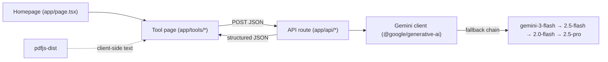

<div align="center">

  

  <h1>AI Tools Hub</h1>

  <p><strong>A modular Next.js hub of Gemini-powered tools for resumes and Upwork proposals — analyze, build, write, and evaluate from one app.</strong></p>

  
  
  

  <br/>

  
  
  
  
  

  <p>
    <a href="https://github.com/yousuf-git/ai-tools-hub">Repository</a> &middot;
    <a href="./docs/TOOLS_CATALOG.md">Tools Catalog</a> &middot;
    <a href="https://github.com/yousuf-git/ai-tools-hub/issues">Report a Bug</a>
  </p>

</div>

---

> AI Tools Hub is a single Next.js 14 app that bundles several independent, AI-powered productivity tools behind a shared homepage. Each tool lives in its own route and talks to Google Gemini through server-side API routes, so adding a new tool is a self-contained change.

##  About

The hub targets developers and freelancers who repeatedly do the same AI-assisted writing tasks: tuning a resume to a job description, building a fresh JD-tailored resume, and drafting or grading Upwork proposals. Instead of separate apps, everything is grouped under one modular front-end.

Core design points, grounded in the code:

- Each tool is a route under `app/tools/` and is independently developed and maintained.
- All AI calls go through Next.js **API routes** (`app/api/*`), which hold the Gemini client server-side.
- Gemini requests use a **model fallback chain** (`gemini-3-flash-preview` → `gemini-2.5-flash` → `gemini-2.0-flash` → `gemini-2.5-pro`), so a rate-limited or unavailable model degrades gracefully instead of failing.
- The UI is built on ShadCN-style components (Radix primitives), Tailwind, Framer Motion animations, and light/dark theming via `next-themes`.

##  Tools

| Tool | Route | What it does |
|---|---|---|
| **Resume & Job Fit Analyzer** | `/tools/resume-analyzer` | Upload a resume + job description for match scores, missing/weak skills, and ATS optimization suggestions. |
| **JD-Tailored Resume Builder** | `/tools/resume-builder` | Build a developer resume tailored to a job description. AI suggests; you control every field with live inline editing and one-click PDF export. |
| **Upwork Proposal Writer** | `/tools/upwork-proposal-writer` | Generate concise, tailored Upwork proposals from a job description, with revision/improvisation support. |
| **Upwork Proposal Examiner** | `/tools/upwork-proposal-examiner` | Evaluate a proposal and get detailed scores plus actionable improvement feedback. |
| **Examiner AI** | external | Upload a PDF, then get quizzed with AI-generated questions to test understanding. Hosted on Hugging Face Spaces. |

> Full feature breakdowns and usage guides: [docs/TOOLS_CATALOG.md](./docs/TOOLS_CATALOG.md).

##  Tech Stack

- **Framework:** Next.js 14 (App Router), React 18
- **Language:** TypeScript 5
- **Styling / UI:** Tailwind CSS 3, ShadCN-style components on Radix UI primitives, `tailwindcss-animate`, `class-variance-authority`
- **Animations:** Framer Motion
- **Theming:** next-themes (dark/light)
- **Icons:** Lucide React
- **AI:** Google Gemini via `@google/generative-ai`
- **PDF:** `pdfjs-dist` (client-side text extraction)
- **State:** React hooks + Zustand
- **Tooling:** ESLint (`eslint-config-next`), PostCSS, Autoprefixer

##  Architecture

The browser renders a tool page, which extracts any input (e.g. PDF text) client-side and POSTs to a Next.js API route. The route holds the Gemini client, walks the model fallback chain, and returns structured JSON to the UI.



Tool-to-endpoint map:

| Tool | API route |
|---|---|
| Resume & Job Fit Analyzer | `POST /api/analyze-resume` |
| JD-Tailored Resume Builder | `POST /api/resume` |
| Upwork Proposal Writer | `POST /api/generate-proposal` |
| Upwork Proposal Examiner | `POST /api/examine-proposal` |

##  Project Structure

```
tools-hub/
├── app/
│   ├── layout.tsx                 # Root layout + theme provider
│   ├── page.tsx                   # Homepage with tool cards
│   ├── api/                       # Server-side Gemini routes
│   │   ├── analyze-resume/        # Resume analysis
│   │   ├── resume/                # JD-tailored resume builder
│   │   ├── generate-proposal/     # Proposal writer
│   │   └── examine-proposal/      # Proposal examiner
│   └── tools/
│       ├── resume-analyzer/
│       ├── resume-builder/        # Wizard, live editor, PDF preview
│       ├── upwork-proposal-writer/
│       └── upwork-proposal-examiner/
├── components/
│   ├── ui/                        # ShadCN-style Radix components
│   ├── theme-provider.tsx
│   └── theme-toggle.tsx
├── lib/
│   ├── gemini.ts                  # Gemini integration helpers
│   ├── pdf-parser.ts              # PDF text extraction
│   ├── resume/                    # Resume types, seed, storage, AI helpers
│   └── utils.ts                   # cn() helper
├── docs/                          # Tools catalog, architecture, guides
├── next.config.js                # pdfjs webpack config
└── tailwind.config.ts
```

##  Getting Started

### Prerequisites

- Node.js 18+
- A Google Gemini API key — [get one here](https://makersuite.google.com/app/apikey)

### Installation

```bash
git clone https://github.com/yousuf-git/ai-tools-hub.git
cd ai-tools-hub
npm install
```

### Environment

```bash
cp .env.example .env
```

Then set your key in `.env`:

```env
NEXT_PUBLIC_GEMINI_API_KEY=your_gemini_api_key_here
```

### Running

```bash
npm run dev      # start the dev server at http://localhost:3000
npm run build    # production build
npm start        # serve the production build
npm run lint     # ESLint
```

##  Configuration

| Variable | Description | Required |
|---|---|---|
| `NEXT_PUBLIC_GEMINI_API_KEY` | Google Gemini API key used by all AI tool routes | Yes |

##  Adding a New Tool

The modular layout makes new tools self-contained:

1. Create `app/tools/your-tool-name/page.tsx` for the UI.
2. Add an API route under `app/api/your-tool-name/route.ts` if it needs Gemini.
3. Register the tool in the `tools` array in `app/page.tsx` (id, name, description, icon, href, color).

##  Deployment

Deploy on Vercel:

1. Push to GitHub.
2. Import the repository at [vercel.com](https://vercel.com).
3. Add the `NEXT_PUBLIC_GEMINI_API_KEY` environment variable.
4. Deploy.

##  Contributing

Fork the repo, add your tool or fix in an isolated route/module, and open a PR. See [docs/CONTRIBUTING.md](./docs/CONTRIBUTING.md) for guidelines.

##  License

MIT — see [LICENSE](LICENSE).

##  Author

**M. Yousuf** — [GitHub](https://github.com/yousuf-git) · [LinkedIn](https://linkedin.com/in/muhammad-yousuf952)
